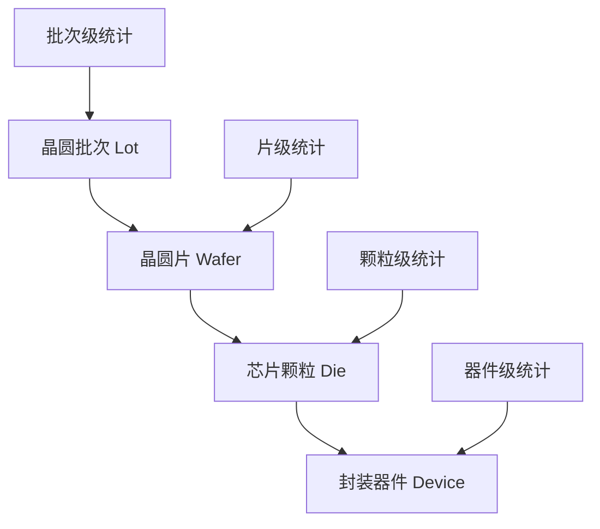

## 前言

在半导体制造过程中，我们需要用不同的单位来统计和管理生产进度。**颗数**、**片数**、**条数**是三个最常用的计量单位，就像我们日常生活中用"个"、"箱"、"车"来计算不同的物品一样。理解这些单位对于半导体生产管理非常重要。

## 半导体制造中的"物料"概念

为了理解这三个计量单位，我们先来看看半导体制造中的物料是什么样的：

### 形象比喻
想象一下制作饼干的过程：
- **面团** = 晶圆批次(Lot/Batch)
- **饼干片** = 单片晶圆(Wafer) 
- **小饼干** = 芯片颗粒(Die/Chip)
- **包装好的饼干** = 封装器件(Device)

### 实际的层级结构
```
一个生产批次
    ↓
包含多片晶圆（像多张饼干片）
    ↓  
每片晶圆上有很多芯片（像饼干片上的小饼干）
    ↓
芯片封装后变成最终产品
```

### 物料层级关系图



## 第一种单位：颗数（Die Count）

### 什么是"颗"？

**颗数**就是指**芯片的个数**，就像数糖果一样数芯片的数量。

### 通俗解释

想象一下：
- 一片晶圆就像一张饼干片
- 这张饼干片上密密麻麻刻着很多小方格
- 每个小方格就是一个芯片，我们叫它"一颗"
- 一片12英寸的晶圆上可能有几百到几千颗芯片

### 实际例子

```
一片晶圆 = 1片
这片晶圆上有 = 1000颗芯片

如果一个批次有25片晶圆：
总共就有 = 25 × 1000 = 25000颗芯片
```

### 为什么要用"颗数"统计？

- **最精确**：可以准确知道到底生产了多少个芯片
- **算良率**：比如投入1000颗，最后合格950颗，良率就是95%
- **算成本**：每颗芯片的成本是多少钱
- **算产能**：设备一小时能处理多少颗芯片

### 计算方式

```java
public class DieProgressCalculator {
  
    /**
     * 计算进展颗树
     * @param waferCount 晶圆片数
     * @param diePerWafer 每片晶圆的芯片数
     * @param yieldRate 良率
     * @return 进展颗树
     */
    public int calculateProgressDieCount(int waferCount, int diePerWafer, double yieldRate) {
        return (int) (waferCount * diePerWafer * yieldRate);
    }
  
    /**
     * 按工序计算累计进展颗树
     */
    public Map<String, Integer> calculateProgressByProcess(Batch batch) {
        Map<String, Integer> progressMap = new HashMap<>();
      
        for (ProcessStep step : batch.getProcessSteps()) {
            int inputDieCount = step.getInputDieCount();
            double stepYield = step.getYieldRate();
            int outputDieCount = (int) (inputDieCount * stepYield);
          
            progressMap.put(step.getProcessName(), outputDieCount);
        }
      
        return progressMap;
    }
}
```

### 应用场景

#### 1. 生产进度监控

```sql
-- 查询各工序的进展颗树
SELECT 
    process_name,
    batch_id,
    SUM(progress_die_count) as total_die_progress,
    AVG(yield_rate) as avg_yield_rate
FROM process_progress 
WHERE batch_id = 'BATCH_001'
GROUP BY process_name, batch_id
ORDER BY process_sequence;
```

#### 2. 良率分析

```java
public class YieldAnalysis {
  
    public double calculateProcessYield(String processName, String batchId) {
        int inputDieCount = getInputDieCount(processName, batchId);
        int outputDieCount = getProgressDieCount(processName, batchId);
      
        return (double) outputDieCount / inputDieCount;
    }
  
    public YieldTrend analyzeYieldTrend(String processName, LocalDate startDate, LocalDate endDate) {
        List<ProcessRecord> records = getProcessRecords(processName, startDate, endDate);
      
        return records.stream()
            .collect(Collectors.groupingBy(
                record -> record.getProcessDate(),
                Collectors.averagingDouble(this::calculateYield)
            ));
    }
}
```

## 第二种单位：片数（Wafer Count）

### 什么是"片"？

**片数**就是指**晶圆的片数**，就像数纸张一样数晶圆的数量。

### 通俗解释

继续用饼干的比喻：
- 如果"颗"是饼干片上的小饼干个数
- 那么"片"就是饼干片本身的数量
- 不管这张饼干片上有多少小饼干，它都算"1片"

### 实际例子

```
一个生产批次包含：
- 25片晶圆（就是25片）
- 不管每片上有多少颗芯片，都是25片

设备处理能力：
- 某台设备一小时可以处理5片晶圆
- 不管这5片上总共有多少颗芯片
```

### 为什么要用"片数"统计？

- **设备管理**：很多设备是按"片"来处理的，比如一次放入5片晶圆
- **工艺控制**：某些工艺参数是按片设定的，比如每片的处理时间
- **物料追踪**：追踪晶圆在各个工序间的流转
- **简单直观**：比颗数更容易理解和管理

### 数据结构设计

```sql
-- 进站记录表
CREATE TABLE wafer_station_log (
    id BIGINT PRIMARY KEY AUTO_INCREMENT,
    batch_id VARCHAR(50) NOT NULL,
    process_name VARCHAR(100) NOT NULL,
    station_id VARCHAR(50) NOT NULL,
    wafer_input_count INT NOT NULL,
    wafer_output_count INT,
    station_time TIMESTAMP NOT NULL,
    operator_id VARCHAR(50),
    equipment_id VARCHAR(50),
    remarks TEXT,
    created_time TIMESTAMP DEFAULT CURRENT_TIMESTAMP,
  
    INDEX idx_batch_process (batch_id, process_name),
    INDEX idx_station_time (station_time)
);
```

### 应用场景

#### 1. 设备产能计算

```java
public class EquipmentCapacityCalculator {
  
    /**
     * 计算设备小时产能（片/小时）
     */
    public double calculateHourlyCapacity(String equipmentId, LocalDate date) {
        List<StationRecord> records = getStationRecords(equipmentId, date);
      
        int totalWafers = records.stream()
            .mapToInt(StationRecord::getWaferInputCount)
            .sum();
          
        double totalHours = calculateTotalProcessingHours(records);
      
        return totalWafers / totalHours;
    }
  
    /**
     * 预测批次处理时间
     */
    public Duration estimateProcessingTime(String equipmentId, int waferCount) {
        double hourlyCapacity = getEquipmentHourlyCapacity(equipmentId);
        double estimatedHours = waferCount / hourlyCapacity;
      
        return Duration.ofMinutes((long) (estimatedHours * 60));
    }
}
```

#### 2. 批次流转监控

```java
public class BatchFlowMonitor {
  
    /**
     * 监控批次在工序间的片数变化
     */
    public List<WaferFlowRecord> trackWaferFlow(String batchId) {
        return processSteps.stream()
            .map(process -> {
                int inputCount = getWaferInputCount(batchId, process);
                int outputCount = getWaferOutputCount(batchId, process);
                double lossRate = (double) (inputCount - outputCount) / inputCount;
              
                return WaferFlowRecord.builder()
                    .processName(process)
                    .inputCount(inputCount)
                    .outputCount(outputCount)
                    .lossRate(lossRate)
                    .build();
            })
            .collect(Collectors.toList());
    }
}
```

## 第三种单位：条数（Strip Count）

### 什么是"条"？

**条数**是指**载具或包装的条数**，主要用在封装和测试阶段。

### 通俗解释

继续用例子来说明：
- 想象芯片加工完成后，需要放到"托盘"里进行测试
- 这个"托盘"就叫做载具或者条
- 每个托盘可以放一定数量的芯片
- 我们按托盘的数量来统计，就是"条数"

### 实际例子

```
封装测试阶段：
- 1000颗芯片封装完成
- 每个测试载具可以放50颗芯片
- 需要 1000 ÷ 50 = 20个载具
- 所以是20条

包装阶段：
- 每条包装带可以装100个芯片
- 1000颗芯片需要10条包装带
```

### 不同阶段的"条"含义

- **封装阶段**：引线框架条数（芯片焊接在上面的框架）
- **测试阶段**：测试载具条数（放芯片进行测试的托盘）
- **包装阶段**：包装条数（最终包装的条带）

### 为什么要用"条数"统计？

- **载具管理**：知道需要多少个托盘或载具
- **测试安排**：测试设备按条来安排测试计划
- **包装规格**：按标准规格进行包装
- **物流方便**：运输和存储都按条来计算

### 载具管理系统

```java
public class CarrierManagementSystem {
  
    /**
     * 载具信息
     */
    @Entity
    public class Carrier {
        private String carrierId;
        private CarrierType type;
        private int capacity;        // 载具容量
        private CarrierStatus status;
        private String currentLocation;
        private LocalDateTime lastUsedTime;
    }
  
    /**
     * 进站条数记录
     */
    @Entity
    public class StripStationRecord {
        private String batchId;
        private String processName;
        private int stripInputCount;     // 进站条数
        private int stripOutputCount;    // 出站条数
        private List<String> carrierIds; // 使用的载具ID列表
        private LocalDateTime stationTime;
    }
  
    /**
     * 计算所需载具数量
     */
    public int calculateRequiredCarriers(int deviceCount, int carrierCapacity) {
        return (int) Math.ceil((double) deviceCount / carrierCapacity);
    }
}
```

### 应用场景

#### 1. 测试产能规划

```java
public class TestCapacityPlanner {
  
    /**
     * 基于条数计算测试产能
     */
    public TestCapacity calculateTestCapacity(String testerId, int stripCount) {
        TestEquipment equipment = getTestEquipment(testerId);
      
        // 每条测试时间
        Duration timePerStrip = equipment.getTimePerStrip();
      
        // 并行测试数量
        int parallelCount = equipment.getParallelTestCount();
      
        // 总测试时间
        Duration totalTime = timePerStrip.multipliedBy(
            (long) Math.ceil((double) stripCount / parallelCount)
        );
      
        return TestCapacity.builder()
            .stripCount(stripCount)
            .estimatedTime(totalTime)
            .parallelCount(parallelCount)
            .build();
    }
}
```

#### 2. 载具调度优化

```java
public class CarrierScheduler {
  
    /**
     * 载具调度算法
     */
    public List<CarrierAssignment> scheduleCarriers(List<TestRequest> requests) {
        List<CarrierAssignment> assignments = new ArrayList<>();
      
        // 按优先级排序请求
        requests.sort(Comparator.comparing(TestRequest::getPriority).reversed());
      
        for (TestRequest request : requests) {
            List<Carrier> availableCarriers = findAvailableCarriers(
                request.getRequiredStripCount(),
                request.getCarrierType()
            );
          
            if (availableCarriers.size() >= request.getRequiredStripCount()) {
                assignments.add(createAssignment(request, availableCarriers));
                markCarriersAsUsed(availableCarriers);
            } else {
                // 载具不足，加入等待队列
                addToWaitingQueue(request);
            }
        }
      
        return assignments;
    }
}
```

## 三种单位的关系和转换

### 简单理解它们的关系

用一个完整的例子来说明：

```
一个生产批次：
├── 25片晶圆（片数 = 25）
├── 每片1000颗芯片
├── 总共25000颗芯片（颗数 = 25000）
├── 封装测试时，每50颗装一个载具
└── 需要500个载具（条数 = 500）
```

### 转换关系

#### 颗数 ↔ 片数
```
颗数 = 片数 × 每片芯片数
片数 = 颗数 ÷ 每片芯片数（向上取整）

例子：
- 25片晶圆，每片1000颗 → 25000颗
- 23500颗芯片，每片1000颗 → 24片（向上取整）
```

#### 颗数 ↔ 条数
```
条数 = 颗数 ÷ 每条容量（向上取整）
颗数 = 条数 × 每条容量

例子：
- 25000颗芯片，每条50颗 → 500条
- 500条载具，每条50颗 → 25000颗
```

#### 片数 ↔ 条数
```
这个转换需要通过颗数来计算：
片数 → 颗数 → 条数

例子：
- 25片晶圆 → 25000颗芯片 → 500条载具
```

### 数量关系

```java
public class UnitConverter {
  
    /**
     * 单位转换关系
     */
    public class ConversionContext {
        private int diePerWafer;      // 每片芯片数
        private int waferPerStrip;    // 每条晶圆数
        private int devicePerStrip;   // 每条器件数
    }
  
    /**
     * 颗数转片数
     */
    public int dieCountToWaferCount(int dieCount, int diePerWafer) {
        return (int) Math.ceil((double) dieCount / diePerWafer);
    }
  
    /**
     * 片数转条数
     */
    public int waferCountToStripCount(int waferCount, int waferPerStrip) {
        return (int) Math.ceil((double) waferCount / waferPerStrip);
    }
  
    /**
     * 颗数转条数（封装后）
     */
    public int dieCountToStripCount(int dieCount, int devicePerStrip) {
        return (int) Math.ceil((double) dieCount / devicePerStrip);
    }
}
```

### 统计报表应用

```sql
-- 综合生产统计报表
SELECT 
    b.batch_id,
    b.product_code,
    -- 进展颗树统计
    SUM(p.progress_die_count) as total_die_progress,
    -- 进站片数统计  
    SUM(w.wafer_input_count) as total_wafer_input,
    -- 进站条数统计
    SUM(s.strip_input_count) as total_strip_input,
    -- 综合良率
    ROUND(SUM(p.progress_die_count) / SUM(p.input_die_count) * 100, 2) as overall_yield_rate
FROM batch b
LEFT JOIN process_progress p ON b.batch_id = p.batch_id
LEFT JOIN wafer_station_log w ON b.batch_id = w.batch_id  
LEFT JOIN strip_station_record s ON b.batch_id = s.batch_id
WHERE b.create_date >= '2024-01-01'
GROUP BY b.batch_id, b.product_code
ORDER BY b.create_date DESC;
```

## MES系统中的实现

### 数据模型设计

```java
/**
 * 生产进度实体
 */
@Entity
@Table(name = "production_progress")
public class ProductionProgress {
  
    @Id
    private String progressId;
  
    @Column(name = "batch_id")
    private String batchId;
  
    @Column(name = "process_name")
    private String processName;
  
    // 三种计量单位
    @Column(name = "progress_die_count")
    private Integer progressDieCount;    // 进展颗树
  
    @Column(name = "wafer_input_count")
    private Integer waferInputCount;     // 进站片数
  
    @Column(name = "strip_input_count")
    private Integer stripInputCount;     // 进站条数
  
    @Column(name = "process_time")
    private LocalDateTime processTime;
  
    @Column(name = "yield_rate")
    private Double yieldRate;
  
    // 转换方法
    public int calculateWaferCountFromDie(int diePerWafer) {
        return (int) Math.ceil((double) progressDieCount / diePerWafer);
    }
  
    public int calculateStripCountFromWafer(int waferPerStrip) {
        return (int) Math.ceil((double) waferInputCount / waferPerStrip);
    }
}
```

### 服务层实现

```java
@Service
public class ProductionProgressService {
  
    /**
     * 记录生产进度
     */
    public void recordProgress(String batchId, String processName, 
                              ProgressData progressData) {
        ProductionProgress progress = new ProductionProgress();
        progress.setBatchId(batchId);
        progress.setProcessName(processName);
        progress.setProgressDieCount(progressData.getDieCount());
        progress.setWaferInputCount(progressData.getWaferCount());
        progress.setStripInputCount(progressData.getStripCount());
        progress.setProcessTime(LocalDateTime.now());
      
        // 计算良率
        double yieldRate = calculateYieldRate(batchId, processName);
        progress.setYieldRate(yieldRate);
      
        progressRepository.save(progress);
      
        // 发送进度更新事件
        eventPublisher.publishEvent(new ProgressUpdateEvent(progress));
    }
  
    /**
     * 获取批次综合进度
     */
    public BatchProgressSummary getBatchProgress(String batchId) {
        List<ProductionProgress> progressList = 
            progressRepository.findByBatchIdOrderByProcessTime(batchId);
      
        return BatchProgressSummary.builder()
            .batchId(batchId)
            .totalDieProgress(calculateTotalDieProgress(progressList))
            .totalWaferInput(calculateTotalWaferInput(progressList))
            .totalStripInput(calculateTotalStripInput(progressList))
            .overallYieldRate(calculateOverallYield(progressList))
            .processDetails(progressList)
            .build();
    }
}
```

## 质量管理应用

### 良率分析

```java
public class YieldAnalysisService {
  
    /**
     * 按不同单位分析良率
     */
    public YieldAnalysisResult analyzeYield(String batchId) {
        List<ProductionProgress> progressList = getProgressData(batchId);
      
        // 按颗粒级良率分析
        double dieYieldRate = calculateDieYieldRate(progressList);
      
        // 按晶圆级良率分析  
        double waferYieldRate = calculateWaferYieldRate(progressList);
      
        // 按条级良率分析
        double stripYieldRate = calculateStripYieldRate(progressList);
      
        return YieldAnalysisResult.builder()
            .dieYieldRate(dieYieldRate)
            .waferYieldRate(waferYieldRate)
            .stripYieldRate(stripYieldRate)
            .yieldTrend(calculateYieldTrend(progressList))
            .build();
    }
  
    /**
     * 良率预警
     */
    public void checkYieldAlert(String batchId, String processName) {
        ProductionProgress progress = getCurrentProgress(batchId, processName);
      
        if (progress.getYieldRate() < getYieldThreshold(processName)) {
            YieldAlert alert = YieldAlert.builder()
                .batchId(batchId)
                .processName(processName)
                .currentYield(progress.getYieldRate())
                .threshold(getYieldThreshold(processName))
                .alertTime(LocalDateTime.now())
                .build();
              
            alertService.sendYieldAlert(alert);
        }
    }
}
```

## 报表与可视化

### Dashboard设计

```java
@RestController
@RequestMapping("/api/dashboard")
public class ProductionDashboardController {
  
    /**
     * 生产进度Dashboard数据
     */
    @GetMapping("/progress")
    public DashboardData getProgressDashboard(
            @RequestParam String dateRange,
            @RequestParam(required = false) String productCode) {
      
        // 进展颗树统计
        Map<String, Long> dieProgressStats = 
            progressService.getDieProgressStats(dateRange, productCode);
      
        // 进站片数统计
        Map<String, Long> waferInputStats = 
            progressService.getWaferInputStats(dateRange, productCode);
      
        // 进站条数统计
        Map<String, Long> stripInputStats = 
            progressService.getStripInputStats(dateRange, productCode);
      
        return DashboardData.builder()
            .dieProgressChart(createChart(dieProgressStats))
            .waferInputChart(createChart(waferInputStats))
            .stripInputChart(createChart(stripInputStats))
            .summaryMetrics(calculateSummaryMetrics())
            .build();
    }
}
```

### 图表配置

```javascript
// 前端图表配置示例
const progressChartConfig = {
    title: {
        text: '生产进度统计',
        subtext: '按不同计量单位统计'
    },
    legend: {
        data: ['进展颗树', '进站片数', '进站条数']
    },
    xAxis: {
        type: 'category',
        data: dateLabels
    },
    yAxis: [
        {
            type: 'value',
            name: '颗数',
            position: 'left'
        },
        {
            type: 'value',
            name: '片数/条数',
            position: 'right'
        }
    ],
    series: [
        {
            name: '进展颗树',
            type: 'line',
            yAxisIndex: 0,
            data: dieProgressData
        },
        {
            name: '进站片数',
            type: 'bar',
            yAxisIndex: 1,
            data: waferInputData
        },
        {
            name: '进站条数',
            type: 'bar',
            yAxisIndex: 1,
            data: stripInputData
        }
    ]
};
```

## 测试策略

### 单元测试

```java
@Test
public class ProductionProgressTest {
  
    @Test
    public void testDieCountCalculation() {
        // 测试进展颗树计算
        int waferCount = 25;
        int diePerWafer = 1000;
        double yieldRate = 0.95;
      
        int expectedDieCount = (int) (waferCount * diePerWafer * yieldRate);
        int actualDieCount = calculator.calculateProgressDieCount(
            waferCount, diePerWafer, yieldRate);
      
        assertEquals(expectedDieCount, actualDieCount);
    }
  
    @Test
    public void testUnitConversion() {
        // 测试单位转换
        int dieCount = 23750;
        int diePerWafer = 1000;
      
        int expectedWaferCount = 24; // 向上取整
        int actualWaferCount = converter.dieCountToWaferCount(dieCount, diePerWafer);
      
        assertEquals(expectedWaferCount, actualWaferCount);
    }
  
    @Test
    public void testYieldCalculation() {
        // 测试良率计算
        ProductionProgress progress = createTestProgress();
        progress.setProgressDieCount(950);
        progress.setWaferInputCount(1);
      
        double expectedYield = 0.95; // 950/1000
        double actualYield = yieldService.calculateYield(progress);
      
        assertEquals(expectedYield, actualYield, 0.01);
    }
}
```

## 最佳实践建议

### 1. 数据一致性保证

- **事务管理**：确保三种计量单位的数据更新在同一事务中
- **数据校验**：建立单位转换的一致性校验机制
- **审计日志**：记录所有数据变更的详细日志

### 2. 性能优化

- **索引优化**：为批次ID、工序名称等查询字段建立合适索引
- **数据分区**：按时间或产品类型对大表进行分区
- **缓存策略**：对频繁查询的统计数据进行缓存

### 3. 业务规则管理

- **配置化管理**：将单位转换比例等参数配置化
- **版本控制**：管理不同产品、不同时期的参数变化
- **权限控制**：严格控制数据修改权限

## 什么时候用哪个单位？

### 颗数（最精确）
**适用场景**：
- 计算良率：投入多少颗，产出多少颗
- 成本核算：每颗芯片的成本
- 精确统计：需要知道确切的产品数量

**举例**：
- "这批产品良率95%，投入10000颗，产出9500颗"
- "每颗芯片成本0.5元"

### 片数（设备管理）
**适用场景**：
- 设备产能：设备一次处理多少片
- 工艺时间：每片需要多长时间处理
- 物料管理：晶圆的流转追踪

**举例**：
- "这台设备一小时可以处理20片晶圆"
- "每片晶圆的加工时间是30分钟"

### 条数（载具和包装）
**适用场景**：
- 测试安排：测试设备按条来安排
- 包装规格：按标准包装规格
- 物流运输：运输和存储的基本单位

**举例**：
- "今天要测试100条产品"
- "每条包装带装100颗芯片"

## 总结

**颗数**、**片数**、**条数**是半导体制造中三个重要的计量单位：

- **颗数**：数芯片个数，最精确，用于良率和成本计算
- **片数**：数晶圆张数，用于设备管理和工艺控制  
- **条数**：数载具个数，用于测试安排和包装物流

### 记忆口诀
```
颗数算良率，精确又细致
片数管设备，工艺好控制
条数做测试，包装和物流
```

理解这三个单位，就像理解"个、箱、车"一样简单。不同的场景用不同的单位，让生产管理更加清晰高效。

---

*本文基于半导体制造实践经验总结，如有疑问欢迎交流讨论。*
